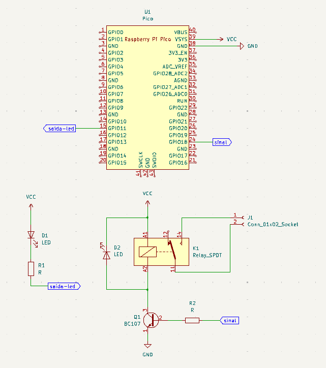
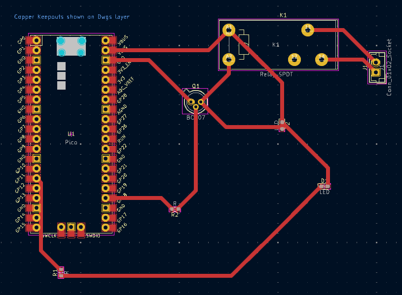

# Atividade Ponderada PCB - Semana 6
Atividade Ponderada - Placa de circuito impresso com Raspberry Pi Pico

Este repositório contém uma atividade que tem por objetivo desenvolver uma placa de circuito impresso capaz de receber um Raspberry Pi Pico W encaixado utilizando um dispositivo conector, além de um hardware para acionar uma interface de potência (relé e transistor), um dispositivo sinalizador (LED ou Buzzer) e um dispositivo de entrada (analógico ou digital). Esta placa deverá ser construída utilizando o software de CAD para placas eletrônicas utilizado no módulo vigente, além de prototipada utilizando as ferramentas disponíveis no laboratório da instituição. Espera-se que os estudantes possam compreender o processo de construção de placas auxiliares de circuito eletrônico.
&emsp; No meu circuito foram utilizados 2 LEDs, 2 resistores, 1 transistor e 1 conector. 

## Imagens
### Esquemático

### PCB

