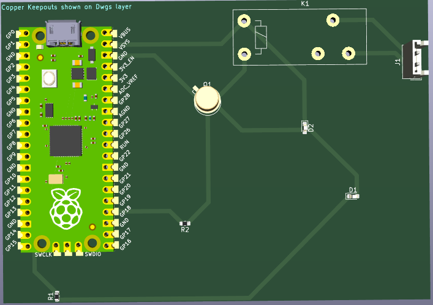

# Atividade Ponderada PCB - Semana 6
Atividade Ponderada - Placa de circuito impresso com Raspberry Pi Pico

Este repositório contém uma atividade que tem por objetivo desenvolver uma placa de circuito impresso capaz de receber um Raspberry Pi Pico W encaixado utilizando um dispositivo conector, além de um hardware para acionar uma interface de potência (relé e transistor), um dispositivo sinalizador (LED ou Buzzer) e um dispositivo de entrada (analógico ou digital). Esta placa deverá ser construída utilizando o software de CAD para placas eletrônicas utilizado no módulo vigente, além de prototipada utilizando as ferramentas disponíveis no laboratório da instituição. Espera-se que os estudantes possam compreender o processo de construção de placas auxiliares de circuito eletrônico.

No meu circuito foram utilizados 2 LEDs, 2 resistores, 1 transistor e 1 conector

## Pastas e Arquivos
`/imagens`

- `esquematico.png`: Imagem do esquemático do circuito.
- `pcb.png`: Imagem da placa de circuito impresso (PCB).
- `representacao.png`: Imagem representativa de algum aspecto do projeto.

`/ponderada-pico`: Pasta do projeto contendo os arquivos do KiCad.

- `ponderada-pico.kicad_pcb`: Arquivo do layout da PCB.
- `ponderada-pico.kicad_prl`: Arquivo de configurações do projeto.
- `ponderada-pico.kicad_pro`: Arquivo principal do projeto que agrega todos os elementos.
- `ponderada-pico.kicad_sch`: Arquivo do esquemático do circuito.
- `/ponderada-pico-backups`: Pasta é usada pelo KiCad para armazenar arquivos salvos automaticament
  
## Imagens
### Esquemático

### PCB

### Visualização 3D

